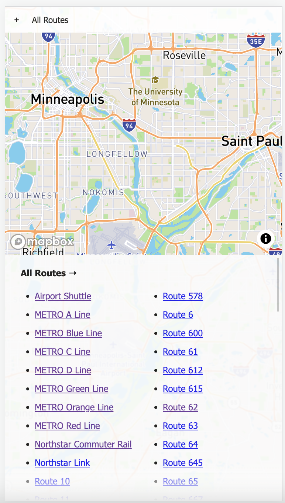
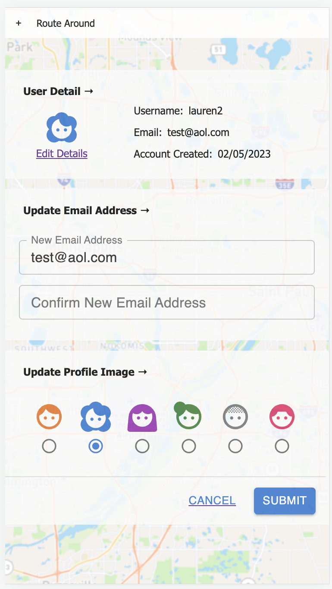

# Route Around

*Duration: Two Weeks*

Route Around is a web application that showcases modern & historic points of interest located along MN Metro Transit routes. My goal for this project was to create a CRUD, RESTful API that promoted transit ridership, encouraged tourism in the Twin Cities, and helped develop a healthy sense of curiousity for the world around us. 

## Approach

This was easily the biggest project I've built to date, and knowing that it was coming down the line, I started thinking through the features I wanted and how I might implement CRUD very early on in the process. I developed a wireframe in Figma, an outline of the database structure I thought I'd need, and scope document highlighting my goals and timelines. Candidly, they were not particularly accurate the first time around, but after workshopping with my instructors and peers I landed on a solid plan to reach MVP (and what might come next).

[Scope Document w/ Wireframes, First-Pass ERD](https://docs.google.com/document/d/1XGXvDvByzFVY3iMQnAQt6xVA3N8h_I7nvBNPS5x4HhM/edit?usp=sharing)

**Final Wireframes & ERD:**
<p align="center">
  
  
</p>

## Getting Started

### Prerequisites
- [React.js](https://beta.reactjs.org/) (built on version 17.0.2)
- [Mapbox GL JS](https://docs.mapbox.com/mapbox-gl-js/guides/) API Key
- [Dotenv](https://www.dotenv.org/docs) file
- [Node.js](https://nodejs.org/en/docs/)
- [Axios](https://axios-http.com/docs/intro)
- [Redux](https://react-redux.js.org/introduction/getting-started)
- [Redux-Saga](https://redux-saga.js.org/docs/introduction/GettingStarted)
- [Material-UI](https://mui.com/material-ui/getting-started/overview/)
- [Express](https://expressjs.com/en/4x/api.html)
- [Body-parser](https://github.com/expressjs/body-parser)
- [Node-postgres](https://node-postgres.com/) (pg)
- [Passport](https://www.passportjs.org/)


### Installation

Using your package manager, install the dependencies.
```
$ ~ npm install
```

In your database manager, create a database named route_around. Use the provided database files to create the necessary tables for this project. Dummy data has been included for one transit line and one point of interest.

Populate your dotEnv file with:
```
SERVER_SESSION_SECRET= 'string' 
mapboxgl.accessToken= 'string'
```

With your database set up, start the server.
```
$ ~ npm run server
```

With the server running, open another terminal window and start your client. Navigate to http://localhost:3000 if the run client script doesn't automatically open the application.
```
$ ~ npm run client
```

### Built With

- [React.js](https://beta.reactjs.org/)
- [Node.js](https://nodejs.org/en/docs/)
- [Material-UI](https://mui.com/): Form & Navbar components/styling
- [Passport](https://www.passportjs.org/): Secure login & account management
- [Postico 2](https://eggerapps.at/postico2/): Database manager 
- [Mapbox GL JS](https://docs.mapbox.com/mapbox-gl-js/guides/)
- [Metro Transit General Transit Feed Specification (GTFS) data](https://svc.metrotransit.org/index.html)

For a full list of dependencies, see the package.json

## Usage

1. **Log In/Register:** First view on open, toggles between Log In/Register depending on user account status. Registration only requires the user to create a username and password.
2. **Dashboard:** Landing page once logged in. Shows a map of the Twin Cities, as well as popular routes and the users 'loved' points of interest (if any exist).
3. **All Routes:** A list of all Metro Transit routes. Each route name is a link that sends the user to that route's detail page.
4. **Route Detail:** Displays a map with the entire route drawn. Below that the user can see the following details:
     - Route name
     - Metro Transit agency responsible for operating that line
     - Type of vehicle that route uses (light rail/bus)
     - Brief description of the route (start/end/major stops)
     - Link to additional fare & schedule info
     - Link to start the Active Route view
5. **All Points of Interest:** A map with pins on the location of each point of interest, and list of all currently available points of interest. Each point name is a link that sends the user ot that point's detail page.
6. **Point of Interest Detail:** Displays a map with a pin dropped on that point's location. Below, the user can see the following details:
     - Name of the point of interest
     - Image of the point (either modern or historic)
     - Click-to-toggle heart icon to love/unlove the point
     - Current address (or indication of demolition)
     - Description of the point and any interesting facts
7. **User Profile:** An individual user's profile page. It shows that user's current profile image, username, associated email address, and date of account creation. Below the user can find sections showing their recent activity and loved points.
8. **Edit User Profile:** Allows the user to edit their profile image and/or update the email address they've listed.
9. **Active Route:** A scrolly-telling split screen. The top half is a map with pins; the bottom half is a series of building names and brief facts about the location. As the user scrolls through the building names/descriptions a point becomes 'active' and the map flies to the corresponding pin. 

## Screenshots

<p align="center">
  
  
  
</p>
<p align="center">
  
  
  
</p>
<p align="center">
  
  
  
</p>

## Notes

**Thoughts:** This was a really satisfying project for me. It's an idea I had a few years ago, and in the time since then I haven't found anything that did *this*, specifically. I've enjoyed getting to know more about the sights I've seen on my commute, and it was honestly so cool to make something that I dreamed up! 

**Challenges:** I had a tough time utilizing React with all of my Saga dispatches and getting the DOM to correctly render - this was definitely what took up the bulk of my time. For each route and POI's individual details (images, map line, map pin, etc.) I needed the DOM to render (or re-render) once those details had been set. This I was able to mostly solve - some of the map lines will occasionally occasionally connect their ends together, but I haven't been able to pinpoint the cause of this yet.

**Future State:** There are a few changes I'd like to make, and a few features I'd like to implement at some point: 
- [ ] User Profile / Account Created: Ran out of time to code this, ideally this would be captured and stored on account registration. Right now, what displays is hard-coded.
- [ ] User Profile / Ride History: I didn't code this correctly and ran out of time to fix it. It's currently showing all routes ever marked as completed, not just for a specific user.
- [ ] User Profile / Badges: My wireframe had this as a feature, and I'd like to add some benchmarks/goals for user badges.
- [ ] Active Route / Trip Completion: These are currently hard-coded into my database. I need to add a button at the end of the 'Active Route' view to mark a trip completed.
- [ ] Active Route / Travel by Direction: Currently, the active route only runs one way. The database documents each route's direction, so I'd like to code in some logic to reverse the facts/points for each route.

## Acknowledgement
I am *incredible* grateful for the instructors, staff, and students at Prime Digital Academy - I can't imagine having learned all of this in such a short amount of time without all of their support. In particular, my instructor Matt, who has brought nothing but care and joy to the classroom every day.

Special shout-out to my partner for her endless support, love, and sanity checks! 

